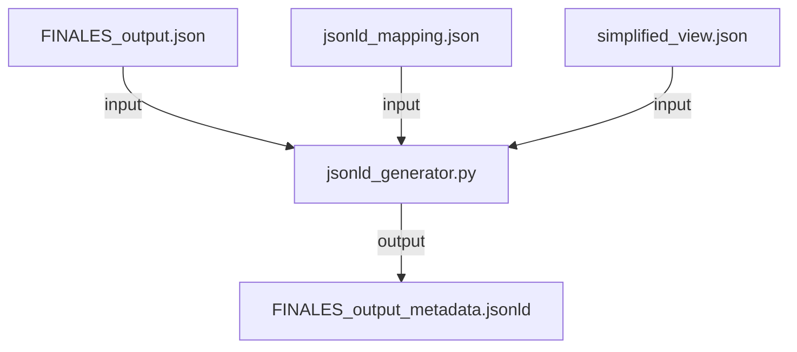

# Report on JSONLD for FINALES

Eibar Flores

Battery and Hydrogen Technologies, SINTEF

26.09.23

# Goal

Build an infrastructure to generate a JSON-LD representation of the measurement outputs from FINALES. The representation will live as a lightweight, human and machine readable `*.jsonld` file along the other output files that build a FINALES Archive record.

# Strategy

The strategy to achieve the goal can be illustrated in the following way:



- `FINALES_output.json` is the output from a FINALES measurement. It follows the format in the Github repository: [FINALES2_schemas/src/FINALES2_schemas/examples/results/conductivity/two_electrode.json at main · BIG-MAP/FINALES2_schemas (github.com)](https://github.com/BIG-MAP/FINALES2_schemas/blob/main/src/FINALES2_schemas/examples/results/conductivity/two_electrode.json)
- `jsonld_mapping.json` maps keys in `FINALES_output.json` to controlled vocabularies:
    - [Schema.org](http://Schema.org), which makes the records findable by most search engines (google, bing, etc).
    - Emmo-based ontologies such as CHAMEO, OSMO and BattINFO, which uniquely describe the meaning of quantities, chemicals, etc.
- `simplified_view.json` outlines a schema for a simplified view of `FINALES_output.json.` I believe a simplified view is required because, as user will search for data, not all the details in `FINALES_output.json` are necessary to include in a knowledge graph. Users will typically search for a measurement result, measuring conductivity, using a particular electrolyte solvent, at a particular temperature. The information that need to be exposed to the knowledgebase is consequently only a subset of the whole data in `FINALES_output.json`. Therefore is convenient that `FINALES_output_metadata.jsonld` only contain the subset of fields that will be mostly used during search. The subset can be of course updated.
- `jsonld_generator.py` is a python script containing all the logic to output the  JSON-LD files.
- `FINALES_output_metadata.jsonld` is the  JSON-LD file  indexing the FINALES result and that will be posted within an Archive record.

# Progress

### `jsonld_mapping.json`: ready

The mapping is ready. Here is the file mapping some selected keys in `FINALES_output.json` to controlled vocabularies. The mapping file can be found in this directory as `conductivity_two_electrode_mapping.jsonld`.


### `simplified_view.json`: suggestion outlined

I have also outlined how the final jsonld output should look like:

- with a subset of fields from `FINALES_output.json`
- a hierarchy following JSONLD example files (can be found here: [JSON-LD Person Example | JSON-LD for SEO's (jsonld.com)](https://jsonld.com/person/))
- The path to the values in the original `FINALES_output.json`

The simplified view developed can be found on `conductivity_two_electrode_simplified_view.jsonld`. Here is a sample:

```json
{
    "@id":"/request_uuid",
    "@type":"MeasurementResult",
    "chameo:hasSampledSample":{
        "@type":["LiquidSolution", "schema:Product"],
        "@id":"/data/run_info/formulation/internal_reference",
        "schema:name":"/data/run_info/formulation_info/name",
        "schema:productionDate":"/data/run_info/formulation_info/preparation_date",
        "schema:serialNumber":"/data/run_info/formulation_info/batch",
        "hasConstituent":{
                "@type":"ChemicalCompound",
                "InChIKey":"/data/run_info/formulation/*/InChIKey",
                "SMILES":"/data/run_info/formulation/*/SMILES"
            }
    },
    "hasMeasuredProperty":{
        "@type":"ElectricConductivity",
        "hasQuantityValue":"/data/conductivity/values/*",
        "hasReferenceUnit":"SiemensPerCentimetre"
    },
    "chameo:hasMeasurementParameter":{
        "@type":"AmbientThermodynamicTemperature",
        "hasQuantityValue":"/data/conductivity/temperature",
        "hasReferenceUnit":"Kelvin"
    },
    "hasSubProcess":{
        "@type":"Conductometry",
        "schema:name":"/method/0"
    }
}
```

### `jsonld_generator.py`: stalled

The aim of the script was to take `FINALES_output.json`, generate a simplified view of the output file using `simplified_view.json` as template, and then append the context in the `jsonld_mapping.json` to build a human and machine readable JSONLD file with a subset of indexable fields from `FINALES_output.json`

I spend significant amount of time trying to develop scripts that load `FINALES_output.json` and output a simplified view of the output file using `simplified_view.json` as template. However I encountered several challenges in `FINALES_output.json`:

- The nesting style is not intuitive. While the hierarchy obeys data exchange requirements from the FINALES infrastructure, the result is not so human-intelligble. For instance:
    - `chemicals` are specified under `formulation`, but then the `name`, `molar mass` and `density` keys are specified under `chemical_info`. It is difficult to code logic to connect the two, since all properties of the chemicals must be within a single chemical object for better indexing.
    - `fraction` values and their units must be under `chemical` objects as well.
- The schemas changed often and so it was difficult to follow up with scripts that adapted to the changes. Its is difficult to code Python logic to process changing schemas

# Way forward

- **FINALES team:** I would like them to develop the scripts to obtain the simplified view of `FINALES_output.json`. See  the `simplified_view.json` section of Progress, above.
    - The contents of the simplified view must be agreed with PIs (which fields to include)
- **SINTEF:** Once the script is ready, then its just a matter of attaching the context from `jsonld_mapping.json`. Thanks to the developement to this stage, adding the right context can be done in a matter of minutes.
- **Archive Team**: I would recommend developing [Schema.org](http://Schema.org) representations of bibliographic metadata. The Archive site currently support exporting bibliographic metadata from records using the Dublin Core of Metadata Terms, which is used in academic settings. However, if we are to make the records findable by search engines, is preferable to support Schema.org vocabularies as well.